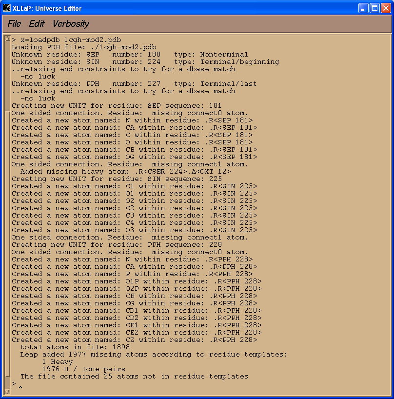
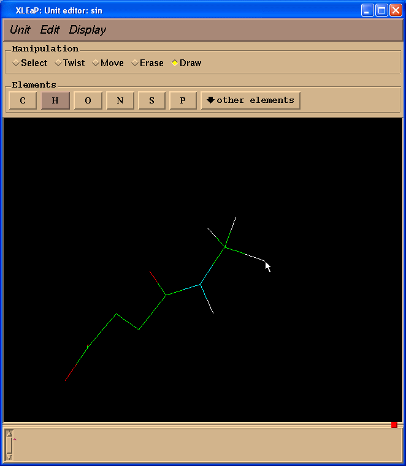

##  Objectives

This section of the tutorial introduces the AMBER programs/tools necessary to set-up the input files required by *sander* for performing minimization and molecular dynamics using non-standard residues.

The main program employed in this section will be **LEaP**: A program that reads in force field, topology and coordinate information and produces the files necessary for production calculations (*i.e.* minimization, molecular dynamics, analysis,...). There are two versions of this program, a graphical interface called *xleap*and a terminal interface called *tleap*. Since we want to "see" graphical representations of our models, this tutorial will use *xleap*.

The workflow for preparing parameter files for non-standard residues is shown below:


At the end we shall see how to analyze MD results extracting information from sander output file. Next we shall use a program ptraj to process and analyze sets of 3-D coordinates read in from the MD trajectory input file.

## Create the necessary topology and coordinate files

The first stage is to create topology (prmtop) and coordinate (inpcrd) files for the system we wish to simulate. We will use Xleap to do this.

The original file, [1CGH.pdb](1CGH.pdb), is an X-ray structure of a human cathepsin G in complex with inhibitor Suc-Val-Pro-Phep-(OPh)2 covalently bonded to the Ser-195 of a protein.


### Editing the pdb file

1) Read all of the header information in a pdb file.

2) All of the connectivity data at the end of the PDB was removed as this will not be used by XLeap.

3) Residue names of cysteines 42, 58, 136, 168, 182, and 201 have been changed from CYS to CYX.

4) All histidine residues in original [1CGH.pdb](1CGH.pdb) file are protonated at both positions, so all HIS residues have been renamed into HIP.

5) Serine-195 residue of a protein is covalently bonded to the PPH residue of an inhibitor. Since we can expect a large disturbance in charge distribution on a Serine-195 after phosphorilation we will define it as a separate residue (SEP in our case   SErine Phosphorilated)

Original:

ATOM   1871  N   SER A 195      13.718  33.026   5.055  1.00 11.57           N

ATOM   1872  CA  SER A 195      14.819  33.619   5.831  1.00 11.59           C

ATOM   1873  C   SER A 195      15.463  32.581   6.740  1.00 10.79           C

ATOM   1874  O   SER A 195      14.748  31.761   7.334  1.00 11.03           O

ATOM   1875  CB  SER A 195      14.319  34.766   6.722  1.00 14.66           C

ATOM   1876  OG  SER A 195      13.988  35.933   5.966  1.00 14.83           O

ATOM   1877  H   SER A 195      12.845  33.454   5.036  1.00 20.00           H

Modified:

ATOM   1871  N   SEP A 195      13.718  33.026   5.055  1.00 11.57           N

ATOM   1872  CA  SEP A 195      14.819  33.619   5.831  1.00 11.59           C

ATOM   1873  C   SEP A 195      15.463  32.581   6.740  1.00 10.79           C

ATOM   1874  O   SEP A 195      14.748  31.761   7.334  1.00 11.03           O

ATOM   1875  CB  SEP A 195      14.319  34.766   6.722  1.00 14.66           C

ATOM   1876  OG  SEP A 195      13.988  35.933   5.966  1.00 14.83           O

ATOM   1877  H   SEP A 195      12.845  33.454   5.036  1.00 20.00           H

 

The resulting pdb file is here: [1cgh-modified.pdb](1cgh-modified.pdb)

Next step was in editing resulting pdb file in molecular editor and deleting all hydrogens and water molecules which are more than 3 A away from the protein.

Pdb file is here: [1cgh-mod2.pdb](1cgh-mod2.pdb)

If simply loaded our edited pdb file above into XLeap at this point the vast majority of the file would load ok. There would be problems, however, with our three non-standard residues SEP, SIN, and PPH.

Start xleap:

**$AMBERHOME/exe/xleap -s -f $AMBERHOME/dat/leap/cmd/leaprc.ff03**

Load PDB file:

**x=loadpdb 1cgh-mod2.pdb**



We see that XLeap cannot load our PDB file successfully. Before we can successfully load our modified pdb file into XLeap we need to tell it what our three non-standard units are.

**Creating SIN unit**

First we shall create library file for our SIN unit. The quickest way to do this, since we need initial structure for this unit, is to simply cut it out of the [1cgh-mod2.pdb](1cgh-mod2.pdb) file and save it as its own pdb file.

So, we cut out SIN and adjacent amino-acid, VAL: [sin-val.pdb](sin-val.pdb). Our aim is to prepare a system for calculating RESP charges using Gaussian.

We load it in into Xleap and start editing

**sin = loadpdb sin-val.pdb**

**edit sin**


Within this window the LEFT mouse button allows atom selection (drag and drop), the MIDDLE mouse button rotates the molecule and the RIGHT mouse button translates it. If the MIDDLE button does not work you can simulate it by holding down the *Ctrl* key and the LEFT mouse button. To make the image larger or smaller, simultaneously hold down the MIDDLE and RIGHT buttons (or *Ctrl* and RIGHT) and move the mouse up to zoom in or down to zoom out.

If you played with selecting atoms using the left mouse button you can unselect a region by holding down the *shift* key while drawing the selection rectangle. To select everything, double click the LEFT button (and to unselect, do the same while holding down the *shift* key).

Then we select  Draw  checkbox in the  Manipulation  panel:


And start to draw missing bonds (click on atom and drag cursor to another atom):


Since we don t need Valine residue to calculate charges but only a N(Me) moiety which will mimic an adjacent amino-acid we switched to  Erase  mode


and started to erase atoms of a valine residue (point cursor on atom to be erased and left-click)


So, our resulting structure looks like this:


Next we shall change two carbon atoms into hydrogen ones. To do so we need to switch back to  Draw  mode and select  H  in  Elements  panel. Then one needs to point cursor to the carbon atoms to be changed and left-click:



Now we need to add missing hydrogen atoms to the SIN residue. The easiest way to do this is to go to the  Unit -> Add H & Build  menu.


Xleap will add more hydrogen atoms than we need however all extra hydrogens could be easily deleted. So, our final structure looks like this:


Geometry is far from ideal however we shall optimize it using Gaussian.

**savepdb sin sin-for-resp.pdb**

We edit it to prepare input file for Gaussian:

ATOM      1  C1  SIN     1      13.529  47.374  -0.405  1.00  0.00

ATOM      2  O1  SIN     1      12.629  47.356  -1.278  1.00  0.00

ATOM      3  O2  SIN     1      14.879  47.872  -0.578  1.00  0.00

ATOM      4  C2  SIN     1      13.079  46.708   0.910  1.00  0.00

ATOM      5  C3  SIN     1      14.191  45.931   1.666  1.00  0.00

ATOM      6  C4  SIN     1      13.679  45.298   2.936  1.00  0.00

ATOM      7  O3  SIN     1      13.739  45.940   3.995  1.00  0.00

ATOM      8 1H1  SIN     1      12.350  46.051   0.719  1.00  0.00

ATOM      9 2H1  SIN     1      12.740  47.407   1.539  1.00  0.00

ATOM     10 3H1  SIN     1      14.943  46.553   1.885  1.00  0.00

ATOM     11  H14 SIN     1      14.531  45.189   1.089  1.00  0.00

TER

ATOM     12  N   VAL     2      12.810  44.301   2.755  1.00  0.00

ATOM     13  H   VAL     2      13.554  43.738   2.367  1.00  0.00

ATOM     14  CA  VAL     2      12.041  43.758   3.871  1.00  0.00

ATOM     15  HA  VAL     2      12.147  44.395   4.749  1.00  0.00

ATOM     16  H18 VAL     2      12.374  42.841   4.091  1.00  0.00

ATOM     17  H19 VAL     2      11.075  43.710   3.618  1.00  0.00

TER

END

And after editing ([sin-for-resp.gjf](sin-for-resp.gjf)):

\# Opt HF/6-31g* Pop=MK iop(6/33=2)

 

SIN

 

-1 1

C1   13.529  47.374  -0.405

O1   12.629  47.356  -1.278

O2   14.879  47.872  -0.578

C2   13.079  46.708   0.910

C3   14.191  45.931   1.666

C4   13.679  45.298   2.936

O3   13.739  45.940   3.995

H11  12.350  46.051   0.719

H12  12.740  47.407   1.539

H13  14.943  46.553   1.885

H14  14.531  45.189   1.089

N    12.810  44.301   2.755

H    13.554  43.738   2.367

C    12.041  43.758   3.871

H    12.147  44.395   4.749

H18  12.374  42.841   4.091

H19  11.075  43.710   3.618

The meaning of the Gaussian options are as follows:

- Opt: We ask for minimization of our structure
- HF/6-31g*: We are using 6-31G* basis set
- Pop=MK: Merz-Kollman atomic charges will be printed out (atomic charges are fitted to the quantum-chemically generated electrostatic potential)
- iop(6/33=2): coordinates of points along with the values of quantum-chemically calculated electrostatic potential in each of them will be printed out. This information will be used later by antechamber for generating the RESP atomic charges.

 

Now we can run the Gaussian G03 program:

**g03 <sin-for-resp.gjf >sin-for-resp.out**

We shall use Antechamber to assign atom types to this molecule and also calculate a set of point RESP charges for us. Antechamber is the most important program within the set of Antechamber tools. It can perform many file conversions and can also assign atomic charges and atom types. As required by the input antechamber executes the following programs (all provide with AMBER 8 and 9): *divcon*, *atomtype*, *am1bcc*, *bondtype*, *espgen*, *respgen* and *prepgen*. It will also generate a series of intermediate files (all in capital letters).

Let's try using antechamber on our [sin-for-resp.out](sin-for-resp.out) file. To create the "prepin" file we require to define a new unit in leap we simply run the following command:

**$AMBERHOME/exe/antechamber -i sin-for-resp.out -fi gout -o sin.prepin -fo prepi -c resp -s 2  rn SIN  at amber  nc -1**

Here the -i [sin-for-resp.out](sin-for-resp.out) specifies the name of the Gaussian output with information about quantum-chemically calculated potential around a molecule

The -fi gout tells antechamber that this is a Gaussian output format file (we could easily have used any number of other supported formats including PDB [pdb], Gaussian Z-Matrix [gzmat], Gaussian Output [gout], MDL [mdl], amber Restart [rst], Sybyl Mol2 [mol2]).

The -o sin.prepin specifies the name of our output file

The -fo prepi states that we want the output file to be of amber PREP format (this is an internal format supported by Leap).

The -c resp option tells antechamber to use the RESP charge model in order to calculate the atomic point charges

The -s 2 option defines the verbosity of the status information provided by antechamber. In this case we have selected verbose output (2).

The  rn SIN defines residue name SIN,

 at amber defines atom types (AMBER in our case), and

 nc -1  is a net molecular charge.

So, go ahead and run the above command. The screen output should be as follows:

Running: /opt/amber8/exe/bondtype -i ANTECHAMBER_BOND_TYPE.AC -o ANTECHAMBER_BOND_TYPE.AC -f ac -j full

Running: /opt/amber8/exe/atomtype -i ANTECHAMBER_AC.AC0 -o ANTECHAMBER_AC.AC -p amber

Running: /opt/amber8/exe/espgen -o ANTECHAMBER.ESP -i sin-for-resp.out

Running: /opt/amber8/exe/respgen -i ANTECHAMBER_RESP.AC -o ANTECHAMBER_RESP1.IN -f resp1

Running: /opt/amber8/exe/respgen -i ANTECHAMBER_RESP.AC -o ANTECHAMBER_RESP2.IN -f resp2

Running: resp -O -i ANTECHAMBER_RESP1.IN -o ANTECHAMBER_RESP1.OUT -e ANTECHAMBER.ESP -t qout

Amber8 Module: resp

resp -O -i ANTECHAMBER_RESP2.IN -o ANTECHAMBER_RESP2.OUT -e ANTECHAMBER.ESP -q qout -t QOUT

 Amber8 Module: resp

Running: /opt/amber8/exe/atomtype -i ANTECHAMBER_PREP.AC0 -o ANTECHAMBER_PREP.AC -p amber

Running: /opt/amber8/exe/prepgen -i ANTECHAMBER_PREP.AC -f int -o sin.prepin -rn "SIN" -rf molecule.res

You should also get a whole series of files written to your directory:

1cgh-mod2.pdb             ANTECHAMBER_RESP1.OUT       punch

1cgh-modified.pdb         ANTECHAMBER_RESP2.IN        qout

1CGH.pdb                  ANTECHAMBER_RESP2.OUT       QOUT

ANTECHAMBER_AC.AC         ANTECHAMBER_RESP.AC         sep-and-pph-for-resp-xleap.pdb

ANTECHAMBER_AC.AC0        ATOMTYPE.INF                sin-for-resp.out

ANTECHAMBER_BOND_TYPE.AC  esout                       sin-for-resp.pdb

ANTECHAMBER.ESP           leap.log                    sin.prepin

ANTECHAMBER_PREP.AC       NEWPDB.PDB                  sin-val.pdb

ANTECHAMBER_PREP.AC0      pph-and-sep-in-protein.pdb

ANTECHAMBER_RESP1.IN      PREP.INF

The files in CAPITALS are all intermediate files used by antechamber and are not required here. You can safely delete them. These files are not deleted by default since they may be of interest if things didn't work correctly.

The file that we are really interested in, and the reason we ran Antechamber in the first place, is the [sin.prepin](sin.prepin) file. This contains the definition of our SIN residue including all of the charges and atom types that we will load into Leap to when creating our prmtop and inpcrd files.

While the most likely combinations of bond, angle and dihedral parameters are defined in this file it is possible that our molecule might contain combinations of atom types for bonds, angles or dihedrals that have not been parameterised. If this is the case then we will have to specify any missing parameters before we can create our prmtop and inpcrd files in Leap.

We can use the utility parmchk to test if all the parameters we require are available.

$AMBERHOME/exe/parmchk -i [sin.prepin](sin.prepin) -f prepi -o [sin.frcmod](sin.frcmod)

Run this command now and it will produce a file called [sin.frcmod](sin.frcmod). This is a parameter file that can be loaded into Leap in order to add missing parameters. Here it will contain all of the missing parameters. If it can antechamber will fill in these missing parameters by analogy to a similar parameter. You should check these parameters carefully before running a simulation. If antechamber can't empirically calculate a value or has no analogy it will either add a default value that it thinks is reasonable or alternatively insert a place holder (with zeros everywhere) and the comment "ATTN: needs revision". In this case you will have to manually parameterize this yourself.

We can see that there were a total of 9 missing bond, 14 angle, and 15 dihedral parameters. Later on we can take a look in Xleap and see what atoms these correspond to. For the purposes of this tutorial we shall assume that the parameters Antechamber has suggested for us are acceptable. Ideally you should really test these parameters (by comparing to *ab initio* calculations for example) to ensure they are reasonable.

To complete creation of a SIN residue we shall load [sin.prepin](sin.prepin) file into Xleap, delete extra atoms which simulate an adjacent peptide bond, and save resulting structure as an Amber library file.

**loadamberprep sin.prepin**

**list**

You should see a new unit called SIN.


**edit SIN**


Delete NMe group:


After deleting NMe group we should ensure that our residue has an integral total charge -1. Charge command will tell us about current total charge:

**charge SIN**


So, we need to add -0.0138 charge. To edit atoms one needs to select them first (left-click and drag a mouse):


Then select from the Menu  Edit -> Edit selected atoms :


We shall see a table:


Left column contains atom names. To see a correspondence between atom names and 3D structure we shall label atoms in the Xleap unit editor:


To ensure that atom names in SIN residue are the same as those in our original pdb file we shall load sin-val.pdb file prepared previously:

**res = loadpdb sin-val.pdb**

**edit res**

We shall see the second window of unit editor:


In this particular case atoms in both structures have the same atom names which is not always the case because during preparation of input file for Gaussian atom name information could be lost.

So, in the table we shall add -0.0138 charge to the C4 atom to have a total charge on the residue -1:


Next we need to save our changes using menu  Table -> Save and quit :


The last thing we need to do before we can save a library file for our completed unit is to tell xleap what is the head atom for this unit and what is the tail atom. This information is used in order to connect the protein back bone. E.g. if we type

**desc SIN**

we will see that there is no tail defined and a wrong head:


So we need to specify these for our SIN unit using **set** command. Type:

**set SIN head nullset SIN tail SIN.SIN.C4**

And that's us done. Now we can save the completed library file using **saveoff** command:

**saveoff SIN sin.lib**

As a final check we shall load again a fragment of an original pdb file, [sin-val.pdb](sin-val.pdb), with SIN residue:

**res = loadpdb sin-val.pdb**


There are no errors reported 

 

 

**Creating SEP and PPH units**

To create library files for SIP and PPH units we shall start in the same manner as for SIN unit: we simply cut it out of the [1cgh-mod2.pdb](1cgh-mod2.pdb) file and save it as its own pdb file.

So, we cut out SEP (former Ser-195), PPH and adjacent amino-acids, Val, Glu, Gly: [pph-and-sep-in-protein.pdb](pph-and-sep-in-protein.pdb).


Our aim is to prepare a system for calculating RESP charges using Gaussian.

We load it in into Xleap and start editing

**res=loadpdb pph-and-sep-in-protein.pdb**


**edit res**


We shall create missing bonds (select "Draw" in "Manipulation" panel):


Delete extra atoms (select "Erase" in "Manipulation" panel):


And, finally, add missing protons. Our final structure looks like this ([pph-for-resp.pdb](pph-for-resp.pdb)):


Input file for Gaussian: [pph-for-resp.gjf](pph-for-resp.gjf)

g03 <[pph-for-resp.gjf](pph-for-resp.gjf) >[pph-for-resp.log](pph-for-resp.log)

Running antechamber:

$AMBERHOME/exe/antechamber -i [pph-for-resp.log](pph-for-resp.log)  -fi gout -o [pph.prepin](pph.prepin) -fo prepi -c resp -s 2 -rn PPH -at amber -nc -1

Its output:

Running: /opt/amber8/exe/bondtype -i ANTECHAMBER_BOND_TYPE.AC -o ANTECHAMBER_BOND_TYPE.AC -f ac -j full

Bond types are assigned for valence state 11 with penalty of 2

Running: /opt/amber8/exe/atomtype -i ANTECHAMBER_AC.AC0 -o ANTECHAMBER_AC.AC -p amber

Running: /opt/amber8/exe/espgen -o ANTECHAMBER.ESP -i pph-for-resp.log

Running: /opt/amber8/exe/respgen -i ANTECHAMBER_RESP.AC -o ANTECHAMBER_RESP1.IN -f resp1

Running: /opt/amber8/exe/respgen -i ANTECHAMBER_RESP.AC -o ANTECHAMBER_RESP2.IN -f resp2

Running: resp -O -i ANTECHAMBER_RESP1.IN -o ANTECHAMBER_RESP1.OUT -e ANTECHAMBER.ESP -t qout

 Amber8 Module: resp

resp -O -i ANTECHAMBER_RESP2.IN -o ANTECHAMBER_RESP2.OUT -e ANTECHAMBER.ESP -q qout -t QOUT

 Amber8 Module: resp

Running: /opt/amber8/exe/atomtype -i ANTECHAMBER_PREP.AC0 -o ANTECHAMBER_PREP.AC -p amber

Running: /opt/amber8/exe/prepgen -i ANTECHAMBER_PREP.AC -f int -o pph.prepin -rn "PPH" -rf molecule.res

We can use the utility parmchk to test if all the parameters we require are available.

$AMBERHOME/exe/parmchk -i [pph.prepin](pph.prepin) -f prepi -o [pph.frcmod](pph.frcmod)

Run this command now and it will produce a file called [pph.frcmod](pph.frcmod). This is a parameter file that can be loaded into Leap in order to add missing parameters.

Load pph.prepin file into Xleap, delete extra atoms which simulate an adjacent peptide bond, and save resulting structure as an Amber library file.

**loadamberprep pph.prepin**

**edit PPH**


Delete atoms mimicking peptide bonds (select "Erase" in "Manipulation" panel):


Count a total charge

**charge PPH**


So, we need to add a charge -0.0259 to the residue. We shall add it to the Phosphorus atom:


Since our current unit PPH contains two residues PPH and SEP we shall split it into two:

**SEP = copy PPH**

This command creates a copy of PPH so that we can edit separately PPH and SEP.

Start editing from  sep  and delete all extra atoms:

**edit SEP**


A problem is that atom names in our SEP residue do not correspond to those in the original pdb. We shall fix it:

We shall name unit and residue as  SEP 

**sepname =  SEP **

**set SEP name sepname**

**set SEP.PPH name sepname**

A final touch will be in defining residue s head and tail atoms

**set SEP head SEP.SEP.N**

**set SEP tail SEP.SEP.C**

**set SEP.SEP restype protein**

Finally we save it as a library file:

**saveoff SEP sep.lib**

 

### Creating PPH residue

Start editing  PPH  and delete all extra atoms:

edit PPH


Unfortunately, during Gaussian calculations information about atom names had been lost, so we need to ensure that our PPH residue has the same atom names as PPH in the original pdb file. To make our task easier we shall download file [pph-and-sep-in-protein.pdb](pph-and-sep-in-protein.pdb)

test = loadpdb [pph-and-sep-in-protein.pdb](pph-and-sep-in-protein.pdb)

edit test


Now we can easily rename atoms in the PPH:


As a final touch we shall define head and tail atoms:

**set PPH head PPH.PPH.N**

**set PPH tail null**


and save it as library file:

**saveoff PPH pph.lib**

 

We quit from Xleap

**quit**

and restart it again

**$AMBERHOME/exe/xleap -s -f $AMBERHOME/dat/leap/cmd/leaprc.ff03**

Before loading our pdb file we shall load library files for three residues, SIN, SEP, PPH, and parameter files, [sin.frcmod](sin.frcmod) and [pph.frcmod](pph.frcmod):

**loadoff sin.lib**

**loadoff sep.lib**

**loadoff pph.lib**

**loadamberparams pph.frcmod**

**loadamberparams sin.frcmod**


Now we can try to load pdb file, [1cgh-mod2.pdb](1cgh-mod2.pdb):

**1cgh = loadpdb 1cgh-mod2.pdb**


Voila, now there are no errors!

As a final touch we should add three S-S bonds between Cys residues as well as a covalent bond between PPH and SEP using **bond** command.

**bond 1cgh.29.SG 1cgh.45.SG**

**bond 1cgh.122.SG 1cgh.187.SG**

**bond 1cgh.152.SG 1cgh.166.SG**

**bond 1cgh.181.OG 1cgh.228.P**

We save protein in library file

**saveoff 1cgh 1cgh.lib**

 

### Preparing input files for Minimisation and MD (in implicit solvent)

We can now go ahead and solvate our system in a truncated octahedral box of TIP3P water.

**solvateoct 1cgh TIP3PBOX 12**

The next thing we need to do is to add counter ions. Before we issue the "addions" command, we need to figure out whether our system is positively or negatively charged.  If it is positively charged, we will want to add negatively charged Cl- ions to counter it and if it is negatively charged, then we'll add Na+ to counter it. To calculate the charge of our system, we can use the command "charge" or  check  (see above):

**charge 1cgh**

Next we charge neutralise our system since it currently has a charge of +27 (check 1cgh). We shall therefore add a total of 27 Cl- ions.

**addions 1cgh Cl- 27**

Saving parameters:

**saveamberparm 1cgh 1cgh-water-box.top 1cgh-water-box.crd**

The resulting topology file, [1cgh-water-box.top](1cgh-water-box.top) and file with coordinates [1cgh-water-box.crd](1cgh-water-box.crd) are quite large.

We can save the resulted structure in the pdb file to be viewed later with a more sophisticated viewing program available

**savepdb 1cgh 1cgh-water-box.pdb**

We can have a look at our system in Xleap:

**edit 1cgh**


 

## Running Minimisation and MD (in explicit solvent)

We shall run our simulations with the explicit solvent. For this section of the tutorial we shall be using the prmtop and inpcrd files ([1cgh-water-box.top](1cgh-water-box.top) and [1cgh-water-box.crd](1cgh-water-box.crd), correspondingly) we created previously.

### Minimisation Stage 1 - Holding the water and counter-ions fixed

            Our minimization procedure will consist of a two stage approach. In the first stage we will keep the protein fixed and just minimize the positions of the counter-ions and water molecules. Then in the second stage we will minimize the entire system.
    
            There are two options for keeping the protein atoms fixed during the initial minimization.
    
            One method is to use the "BELLY" option in which all the selected atoms have the forces on them zeroed at each step. This results in what is essentially a partial minimization. This method used to be the favoured method but it can, especially if used with constant pressure periodic boundary simulations, lead to instabilities and strange artefacts. As a result of this it is no longer the suggested method.
    
            Instead we shall use "positional restraints" on each of the protein atoms to keep them essentially fixed in the same position. Such restraints work by specifying a reference structure, in this case our starting structure, and then restraining the selected atoms to conform to this structure via the use of a force constant. This can be visualized as basically attaching a spring to each of the solute atoms that connects it to its initial position. Moving the atom from this position results in a force which acts to restore it to the initial position. By varying the magnitude of the force constant so the effect can be increased or decreased. This can be especially useful with structures based on homology models which may be a long way from equilibrium and so require a number of stages of minimization / MD with the force constant being reduced each time.

Here is the input file we shall use for our initial minimization of solvent and ions:

```
1cgh: initial minimization of solvent and ions
```

 &cntrl

```
     imin   = 1,
     maxcyc = 500,
     ncyc   = 250,
     ntb    = 1,
     ntr    = 1,
     cut    = 10
```

 &end

Hold the protein fixed

100.0

RES 1 228

END

END

 

The meaning of each of the terms are as follows:

- IMIN = 1: Minimization is turned on (no MD)
- MAXCYC = 500: Conduct a total of 500 steps of minimization.
- NCYC = 250: Initially do 250 steps of steepest descent minimization followed by 500 steps (MAXCYC - NCYC) steps of conjugate gradient minimization.
- NTB = 1: Use constant volume periodic boundaries (PME is always "on" with AMBER 8 when NTB>0).
- CUT = 10: Use a cutoff of 10 angstroms.
- NTR = 1: Use position restraints based on the GROUP input given in the input file. GROUP input is described in detail in the appendix of the user's manual. In this example, we use a force constant of 100 kcal mol-1 angstrom-2 and restrain residues 1 through 228 (the protein and inhibitor). This means that the water and counter-ions are free to move. The GROUP input is the last 5 lines of the input file:

Hold the protein fixed
100.0
RES 1 228
END
END

 

 

 

 

 

 

Command to run sander:

$AMBERHOME/exe/sander -O -i [1cgh-hold-protein.in](1cgh-hold-protein.in) \

      -o [1cgh-hold-protein.out](1cgh-hold-protein.out) -c [1cgh-water-box.crd](1cgh-water-box.crd) \
    
      -p [1cgh-water-box.top](1cgh-water-box.top) -r [1cgh-hold-protein.rst](1cgh-hold-protein.rst) \
    
      -ref [1cgh-water-box.crd](1cgh-water-box.crd)

Input files: [1cgh-hold-protein.in](1cgh-hold-protein.in), [1cgh-water-box.crd](1cgh-water-box.crd), [1cgh-water-box.top](1cgh-water-box.top)

Output Files: [1cgh-hold-protein.out](1cgh-hold-protein.out), [1cgh-hold-protein.rst](1cgh-hold-protein.rst)

            Take a look at the output file from this job. You should notice that there is initially a rather high van-der-Waals (VDWAALS and 1-4 VDW) energy which represents bad contacts in both the water and protein. You should also see that the electrostatic energy (EEL) drops very rapidly. The RESTRAINT energy represents the effect of the harmonic restraints we have imposed. It rises rapidly but then levels off.

To have a quick look at the structure, in order to ensure it still sensible, before proceeding:

ambpdb -p 1cgh-water-box.top  < 1cgh-hold-protein.rst  > [1cgh-hold-protein.pdb](1cgh-hold-protein.pdb)

 

### Minimisation Stage 2 - Minimising the entire system

Now we have minimized the water and ions the next stage of our minimization is to minimize the entire system. In this case we will run 500 steps of minimization without the restraints this time. Here is the input file:

Entire system minimization

 &cntrl

```
     imin   = 1,
     maxcyc = 1000,
     ncyc   = 500,
     ntb    = 1,
     ntr    = 0,
     cut    = 10
```

 &end

 

Note, choosing the number of minimization steps to run is a bit of a black art. Running too few can lead to instabilities when you start running MD. Running too many will not do any real harm since we will just get ever closer to the nearest local minima. It will, however, waste cpu time. Since minimization is generally very quick with respect to the molecular dynamics it is often a good idea to run more minimization steps than really necessary. Here, 500 should be enough.

We run this using the following command. Note, we use the 1cgh-hold-protein.rst file from the previous run, which contains the last structure from the first stage of minimization, as the input structure for stage 2 of our minimization. Note, we also no longer need the -ref switch:

$AMBERHOME/exe/sander -O -i [1cgh-all-minimize.in](1cgh-all-minimize.in) \

-o [1cgh-all-minimize.out](1cgh-all-minimize.out) -c [1cgh-hold-protein.rst](1cgh-hold-protein.rst) \
-p [1cgh-water-box.top](1cgh-water-box.top) -r [1cgh-all-minimize.rst](1cgh-all-minimize.rst)

 

### *Molecular Dynamics (heating) with restraints on the solute*

Now that we have successfully minimised our system the next stage in our equilibration protocol is allow our system to heat up from 0 K to 300 K. In order to ensure this happens without any wild fluctuations in our solute we will use a weak restraint, as we did in stage 1 of the minimization, on the solute (DNA) atoms. Prior to AMBER 8 the recommended method for maintaining temperature was to use the Berendsen thermostat (NTT=1). This method is not very efficient at ensuring the temperature remains even across the system and so one would typically have to use NMR restraints in order to ensure that the heating occurred very gradually over a timescale of about 20 ps. This was essential in order  to avoid problems with hot solvent cold solute etc. AMBER 8 now supports the new Langevin temperature equilibration scheme (NTT=3) which is significantly better at maintaining and equalising the system temperature. As a result the use of NMR restraints is no longer necessary. In fact it may even be possible to simply start our system at 300 K but we shall remain cautious and start from 0 K.

Note: you should use NTT=3 with care since while the Langevin temperature regulation scheme equilibrates the temperature better, as a method of maintaining a constant temperature during a production run it is probably not so good. Experience with using Langevin dynamics for temperature regulation has shown that the best approach in terms of obtaining accurate dynamics, would be to equilibrate the system initially with ntt=3, since it equilibrates temperature very well, and then switch to ntt=1 for the production phase. Alternatively, assuming the system is well equilibrated, you should be able to switch off the thermostat all together and just run the explicit solvent calculation with no thermostat (ntt=0). This is true since the force field is conservative, hence you should be able to maintain constant energy for a very long time. However, errors in the integrator (the fact that you make a timestep approximation) and errors involved in using a cutoff will eventually lead to you bleeding energy over time. Hence a weak thermostat is often a good idea as it corrects for these errors.

The problem with using ntt=3 in a production calculation, is that it alters the dynamics of the system. Essentially the short term dynamics (fast dynamics) are radically altered and so if one is interested in obtaining information about the fast dynamics of a system during the production phase then ntt=3 cannot be used since it corrupts this information. Berendsen (ntt=1) does not do this.

In terms of the long term dynamics ntt=3 also effects these but where such transitions are not directly dependent on the fast dynamics, i.e. something like an A-DNA to B-DNA structural conversion (as we will try later in this tutorial), then ntt=3 can actually server to increase the speed of these dynamics. In other words you can cover more phase space in less time. However, the langevin dynamics while not effecting the actual transition will effect the speed of the transition and as such if you want information regarding timescales of structural interconversions you again need to use ntt=1. However, if you are just interested in going from a high energy structure to a lower one quickly ntt=3 is probably the best method, but if you want to compute things like time correlation functions then you need accurate fast dynamical information so you need to avoid ntt=3. Thus the take home message is: Think carefully about how a thermostat will affect your simulation and choose appropriately.

Our final aim is to run production dynamics at constant temperature and pressure since this more closely resembles laboratory conditions. However, at low temperatures, as our system will be for the first few ps the calculation of pressure is very inaccurate and so using constant pressure periodic boundaries in this situation can lead to problems. Using constant pressure with restraints can also cause problems so initially we will run 20 ps of MD at constant volume. Once our system has equilibrated over approximately 20 ps we will then switch off the restraints and change to constant pressure before running a further 100 ps of equilibration at 300 K.

Since these simulations are significantly more computationally expensive than the *in vacuo* and implicit solvent simulations it is essential that we try to reduce the computational complexity as much as possible. One way to do this is to use triangulated water, that is water in which the angle between the hydrogens is kept fixed. One such model is the TIP3P water model with which we solvated our system. When using such a water model it is essential that the hydrogen atom motion of the water also be fixed since failure to do this can lead to very large inaccuracies in the calculation of the densities etc. Since the hydrogen atom motion in our DNA is unlikely to effect its large scale dynamics we can fix these hydrogens as well. One method of doing this is to use the SHAKE algorithm in which all bonds involving hydrogen are constrained (NTC=2). This method of removing hydrogen motion has the fortunate effect of removing the highest frequency oscillation in the system, that of the hydrogen vibrations. Since it is the highest frequency oscillation that determines the maximum size of our time step (1 fs for the *in vacuo*runs) by removing the hydrogen motion we can safely increase our time step to 2 fs without introducing any instability into our MD simulation. This has the effect of allowing us to cover a given amount of phase space in half as much time since we need only 50,000 steps to cover 100 ps in time as opposed to the 100,000 we required with a 1 fs time step.

Note, if your system is very inhomogeneous you may need to run short MD runs with smaller time steps, say 0.5 fs, before conducting long MD runs with a 2 fs time step. This approach allows the system to rapidly move out of an unfavourable geometry without wild oscillations in the energy.

So, stage 1, 10 ps of MD with weak positional restraints on the DNA. Here is the input file:

```
1cgh: 1ps MD with restraints on protein
 &cntrl
  imin   = 0,
  irest  = 0,
  ntx    = 1,
  ntb    = 1,
  cut    = 10,
  ntr    = 1,
  ntc    = 2,
  ntf    = 2,
  tempi  = 0.0,
  temp0  = 300.0,
  ntt    = 3,
  gamma_ln = 1.0,
  nstlim = 5000, dt = 0.002
  ntpr = 100, ntwx = 100, ntwr = 1000
 /
Keep protein fixed with weak restraints
10.0
RES 1 228
END
END
```

The meaning of each of the terms are as follows:

- IMIN = 0: Minimisation is turned off (run molecular dynamics)
- IREST = 0, NTX = 1: We are generating random initial velocities from a Boltzman distribution and only read in the coordinates from the inpcrd. In other words this is the first stage of our molecular dynamics. Later we will change these values to indicate that we want to restart a molecular dynamics run from where we left off.
- NTB = 1: Use constant volume periodic boundaries (PME is always "on" with AMBER 8 when NTB>0).
- CUT = 10: Use a cutoff of 10 angstroms.
- NTR = 1: Use position restraints based on the GROUP input given in the input file. In this case we will restrain the DNA with a force constant of 10 angstroms.
- NTC = 2, NTF = 2: SHAKE should be turned on and used to constrain bonds involving hydrogen.
- TEMPI = 0.0, TEMP0 = 300.0: We will start our simulation with a temperature, derived from the kinetic energy, of 0 K and we will allow it to heat up to 300 K. The system should be maintained, by adjusting the kinetic energy, as 300 K.
- NTT = 3, GAMMA_LN = 1.0: The langevin dynamics should be used to control the temperature using a collision frequency of 1.0 ps-1.
- NSTLIM = 5000, DT = 0.002: We are going to run a total of 5,000 molecular dynamics steps with a time step of 2 fs per step, possible since we are now using SHAKE, to give a total simulation time of 10 ps.
- NTPR = 100, NTWX = 100, NTWR = 1000: Write to the output file (NTPR) every 100 steps (200 fs), to the trajectory file (NTWX) every 100 steps and write a restart file (NTWR), in case our job crashes and we want to restart it, every 1,000 steps.

We run this using the following command. Note, we use the restrt file from the second stage of our minimization since this contains the final minimized structure. We also use this as the reference structure with which to restrain the protein to:

**$AMBERHOME/exe/sander -O -i 1cgh-md-restr.in \**

**        -o 1cgh-md-restr.out -c 1cgh-all-minimize.rst \**

**        -p 1cgh-water-box.top -r 1cgh-md-restr.rst \**

**        -ref 1cgh-all-minimize.rst -x 1cgh-md-restr.mdcrd**

Note: This simulation may take considerable amount of time to run (about 2 hours on one 2.66 GHz Pentium 4 processor). You can run this yourself if you want or alternatively you can just use the output files provided in the links above.

### Running MD Equilibration on the whole system

Now that we have successfully heated our system at constant volume with weak restraints on the protein the next stage is to switch to using constant pressure, so that the density of our water can relax. At the same time, now we are 300 K we can safely remove the restraints on our protein.

We will run this equilibration for 100 ps to give our system plenty of time to relax.

```
1cgh: 100ps MD
 &cntrl
    imin = 0, irest = 1, ntx = 7,
    ntb = 2, pres0 = 1.0, ntp = 1,
    taup = 2.0,
    cut = 10, ntr = 0,
    ntc = 2, ntf = 2,
    tempi = 300.0, temp0 = 300.0,
    ntt = 3, gamma_ln = 1.0,
    nstlim = 50000, dt = 0.002,
    ntpr = 100, ntwx = 500, ntwr = 1000
 /
```

The meaning of each of the terms are as follows:

- IMIN = 0: Minimisation is turned off (run molecular dynamics)
- IREST = 1, NTX = 7: We want to restart our MD simulation where we left off after the 10 ps of constant volume simulation. IREST tells sander that we want to restart a simulation, so the time is not reset to zero but will start at 10 ps. Previously we have had NTX set at the default of 1 which meant only the coordinates were read from the restrt file. This time, however, we want to continue from where we finished so we set NTX = 7 which means the coordinates, velocities and box information will be read from a formatted (ASCII) restrt file.
- NTB = 2, PRES0 = 1.0, NTP = 1, TAUP = 2.0: Use constant pressure periodic boundary with an average pressure of 1 atm (PRES0). Isotropic position scaling should be used to maintain the pressure (NTP=1) and a relaxation time of 2ps should be used (TAUP=2.0).
- CUT = 10: Use a cut off of 10 angstroms.
- NTR = 0: We are no longer using positional restraints.
- NTC = 2, NTF = 2: SHAKE should be turned on and used to constrain bonds involving hydrogen.
- TEMPI = 300.0, TEMP0 = 300.0: Our system was already heated to 300 K during the first stage of MD so here it will start at 300 K and should be maintained at 300 K.
- NTT = 3, GAMMA_LN = 1.0: The Langevin dynamics should be used to control the temperature using a collision frequency of 1.0 ps-1.
- NSTLIM = 50000, DT = 0.002: We are going to run a total of 50,000 molecular dynamics steps with a time step of 2 fs per step, possible since we are now using SHAKE, to give a total simulation time of 100 ps.
- NTPR = 100, NTWX = 500, NTWR = 1000: Write to the output file (NTPR) every 100 steps (200 fs), to the trajectory file (NTWX) every 500 steps and write a restart file (NTWR), in case our job crashes and we want to restart it, every 1,000 steps.

We run this using the following command. Note, we use the restrt file from the first stage of our MD since this contains the final MD frame, velocities and box information.

$AMBERHOME/exe/sander -O -i [1cgh-equilib-md.in](1cgh-equilib-md.in) \

​                       -o [1cgh-equilib-md.out](1cgh-equilib-md.out) -c [1cgh-md-restr.rst](1cgh-md-restr.rst) \

​                       -p 1cgh-water-box.top -r [1cgh-equilib-md.rst](1cgh-equilib-md.rst) \

​                       -x [1cgh-equilib-md.mdcrd](1cgh-equilib-md.mdcrd.gz)


Note: This simulation may take considerable amount of time to run, on a single 2.66 GHz Pentium 4 processor it takes approximately 23 hours. You can run this yourself if you want but alternatively you can just use the output files provided in the links above.

## Analysing the results to test the equilibration

Now that we have equilibrated our system it is essential that we check that equilibrium has successfully been achieved before moving on to running any production MD simulations in which we would hope to learn something new about our molecule.

There are a number of system properties that we should monitor to check the quality of our equilibrium. These include:

- Potential, Kinetic and Total energy
- Temperature
- Pressure
- Volume
- Density
- RMSd

The following steps will illustrate how to extract this data and plot it and also discuss what we expect to see for a successful equilibration.

### *Analysing the output files*

In this section we will look at the system properties that can be extracted from the data written to the mdout files during our 100ps of MD simulation. This includes the potential, kinetic and total energies, the temperature, pressure, volume and density. Here is file [1cgh-equilib-md.dat](1cgh-equilib-md.dat) which contains time, temperature, pressure, total energy, potential energy, volume, and density, respectively.

Lets plot some of these to see if we have successfully reached an equilibrium. First of all the energies, potential and total:

|  |  |
| ------------------------------------------------------------ | ------------------------------------------------------------ |
|                                                              |                                                              |

The important points to note with this plot is that all of the energies decreased during the first 30 ps. The potential energy, and consequently the total energy, initially decreased and then plateaued for the remainder of our simulation (40 to 110 ps) indicating that the relaxation was completed and that we reached an equilibrium.

Next we plot the temperature:


We see that the temperature remained more or less constant during the simulation indicating the use of Langevin dynamics for temperature regulation was successful.

Next the pressure:


For the first 20 ps the pressure is negative and increases sharply becoming positive. The negative pressures correspond to a "force" acting to decrease the box size and the positive pressures to a "force" acting to increase the box size. The important point here is that while the pressure graph seems to show that the pressure fluctuated wildly during the simulation the mean pressure stabilised around 1 atm after about 20 ps of simulation. This is sufficient to indicate successful equilibration.

Next we plot the volume:


Notice how the volume of our system (in angstroms3) initially decreases as our water box relaxes and reaches and equilibrated density, and thus volume. The smooth transitions in this plot followed by the oscillations about a mean value suggest our equilibration has been successful.

Finally, lets take a look at the density, we expect this to mirror the volume.


Our system has equilibrated at a density of approximately 1.025 g cm-3. This seems reasonable. The density of pure liquid water at 300 K is approximately 1.00 g cm-3 so adding a protein and the associated charges has increased the density by around 2.5 %.

## Analysing the trajectory

Now we have analyzed our output files and seen that the main system properties suggest that our equilibration has been successful the next step is to consider the structures. Have they remained reasonable? One useful measure to consider is the root mean square deviation (RMSd) from the starting structure. We can use *ptraj* to calculate this for us as a function of time. In this situation we are interested in the backbone of our protein so we shall consider just the main backbone atoms, C, CA, and N. We will conduct a standard (not mass weighted) RMS fit to the structure of our final minimization (we are using file 1cgh-all-minimize.rst as a reference). Note, the time is set to 1 this time around since although we wrote to the trajectory file every 500 steps the time step was 2 fs - hence 100 steps = 1 ps. Here is the input file for *ptraj*:

trajin 1cgh-equilib-md.mdcrd.gz

reference 1cgh-all-minimize.rst

rms reference out [1cgh-backbone.rms](1cgh-backbone.rms) @C,N,CA time 1

Lets run *ptraj* to calculate the RMSd of the protein backbone atoms:

$AMBERHOME/exe/ptraj 1cgh-water-box.top <[analize-md.in](analize-md.in)


Here we see that the RMSd of the protein backbone atoms increases slowly as the protein relaxed within the solvent. We don't see any wild oscillations.